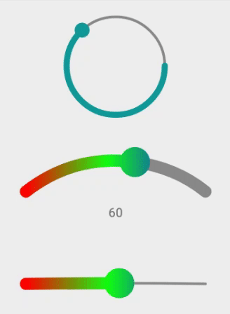
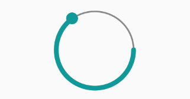
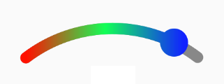
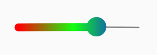
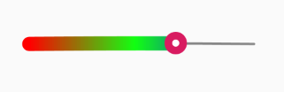
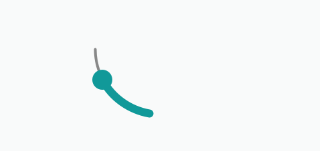

# ZSeekBar

Library was created to make good looking circle, curved and horizontally line SeekBars.


## Usage

SeekMode :
* circle
* arc
* line
 



Here are some usage examples:




```xml
<zHelper.view.ZSeekBar
    android:layout_width="match_parent"
    android:layout_height="150dp"
    android:layout_marginLeft="32dp"
    android:layout_marginRight="32dp"
    app:zProgress="65"
    app:zProgressColor="#199"
    app:zProgressWidth="8dp"
    />
```

Make gradient color 1 :



```xml
<zHelper.view.ZSeekBar
    android:layout_width="match_parent"
    android:layout_height="100dp"
    android:layout_marginTop="8dp"
    android:paddingBottom="16dp"
    app:zProgress="85"
    app:zSeekMode="arc"
    app:zProgressWidth="16dp"
    app:zProgressBackgroundWidth="16dp"
    app:zProgressColorList="#ff1100,#11FF55,#1122FF"
    />
```


Make gradient color 2 :



```xml
<zHelper.view.ZSeekBar
    android:layout_width="match_parent"
    android:layout_height="150dp"
    android:layout_marginTop="8dp"
    app:zProgress="65"
    app:zSeekMode="line"
    app:zProgressWidth="16dp"
    app:zProgressColor="#f00"
    app:zProgressCenterColor="#1f1"
    app:zProgressEndColor="#11f"
    />
```

Use custom thumb :



```xml
<zHelper.view.ZSeekBar
    android:layout_width="match_parent"
    android:layout_height="150dp"
    android:layout_marginTop="8dp"
    app:zProgress="65"
    app:zSeekMode="line"
    app:zProgressColor="#f00"
    app:zProgressCenterColor="#1f1"
    app:zProgressEndColor="#11f"
    app:zProgressWidth="16dp"
    app:zThumb="@drawable/thumb_custom"
    />
```

Play with start angle and sweep angle :



```xml
<zHelper.view.ZSeekBar
    android:layout_width="match_parent"
    android:layout_height="150dp"
    android:layout_marginLeft="32dp"
    android:layout_marginRight="32dp"
    app:zProgress="65"
    app:zProgressColor="#199"
    app:zProgressWidth="8dp"
    app:zStartAngle="100"
    app:zSweepAngle="80"
    />
```


## Customization

ZSeekBar properties are:
* `zStartAngle` - start angle for circle seek mode.
* `zSweepAngle` - sweep angle for circle seek mode.
* `zProgress` - initial value of progress (0 by default).
* `zMaxProgress` max vale of progress (100 by default).
* `zIsRoundEdges` if edges should be rounded or not (`true` by default).
* `zIsClockwise` if progress clockwise or not (`true` by default).
* `zIsFloatingThumbColor` if you want change thumb color base on progress color or not (`true` by default).
* `zProgressBackgroundColor` color of bar behind progress.
* `zProgressColorList` make gradient color of visible progress bar, separator by coma.(eg: #ff0000, #00ff00, #0022ff)
* `zProgressColor` color of visible progress bar.(or gradient start color)
* `zProgressCenterColor` gradient center color of visible progress bar.
* `zProgressEndColor` gradient end color of visible progress bar.
* `zProgressWidth` width of visible progress bar.
* `zProgressBackgroundWidth` width of bar behind progress.
* `zThumbWidth` width of thumb drawable.
* `zThumbTintColor` tint color of thumb.
* `zThumb` reference to thumb drawable.
* `zSemiCircleGravity` if you want semiCircle use it or not (`none` , `top` and `bottom` default is `none`).
* `zSeekMode` if you want change seek mode use it or not (`circle` , `arc` and `line` default is `circle`).


important:
To make gradient color :
* use `zProgressColorList` and color separator by coma.(eg: #ff0000, #00ff00, #0022ff)
* or use `zProgressColor` start color, `zProgressCenterColor` center color and `zProgressEndColor` end color


## Customization in Style

* `zSeekBarStyle` reference for customization in style.


## Installation

**You need to compile sdk 27+**

Just add following dependency in your module `build.gradle`:

```groovy
dependencies {
    implementation 'com.github.zabih1420:ZSeekBar:1.0'
}
```

Also add on your module `build.gradle` (unless you already have it):

```groovy
repositories {
    maven { url 'https://jitpack.io' }
}
```


License
-------

    Copyright 2019 Zabih

    Licensed under the Apache License, Version 2.0 (the "License");
    you may not use this file except in compliance with the License.
    You may obtain a copy of the License at

       http://www.apache.org/licenses/LICENSE-2.0

    Unless required by applicable law or agreed to in writing, software
    distributed under the License is distributed on an "AS IS" BASIS,
    WITHOUT WARRANTIES OR CONDITIONS OF ANY KIND, either express or implied.
